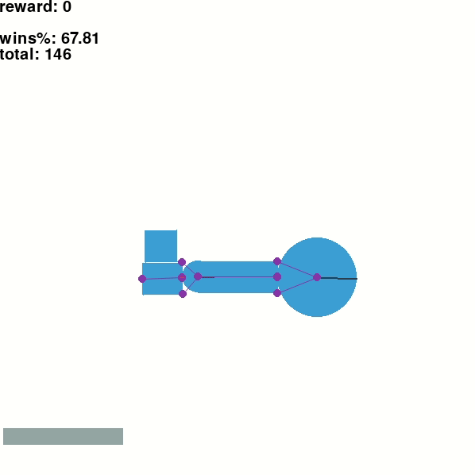
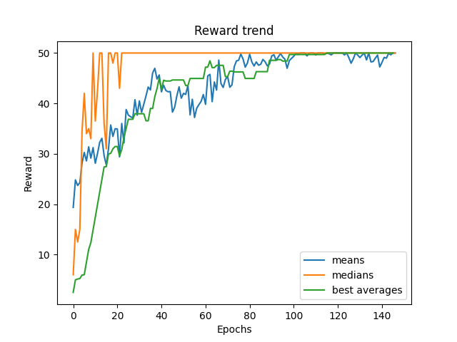
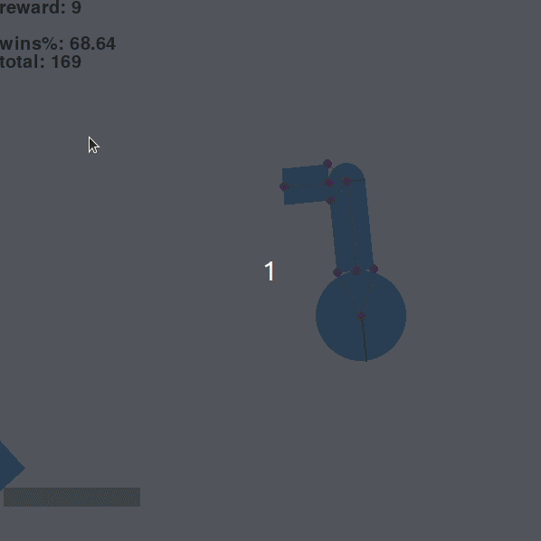
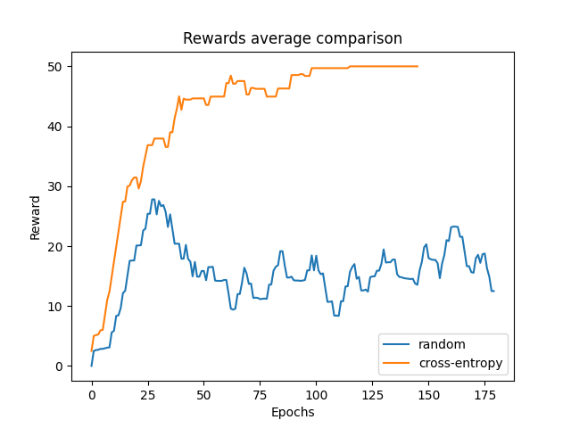
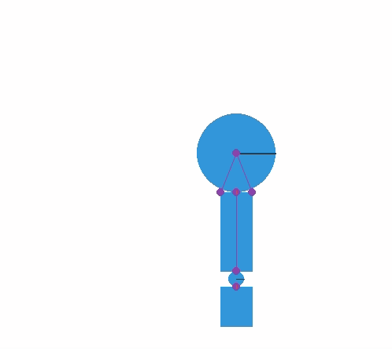

# Reinforcement Learning for Controlling a Mechanic Arm
We set the task as follows: given an arm holding a box, manipulate the arm's
circle motors to put the box on a table.



The repository contains the implementation of all the subtasks of the problem:
* Physical simulation of the objects
* Physical (more or less) design of the mechanic arm
* Graphical presentation of the learning process, as well as
the interactive mode
* Reinforcement learning algorithms (currently only cross-entropy)
* Results that one can achieve with these algorithms

## Running on your desktop
### Pre-requisites
Python3 and `pip3 install -r requirements.txt`.

### Running simulation
```commandline
python3 main.py [-i | -r]
```
Flags enable different modes:
- no flags - default mode: run with a cross-entropy agent
- `-r`: run with a random agent (uniformly chooses a random action each step)
- `-i`: interactive mode (controlled by the user).

Interactive mode controls:
- Left / Right arrow keys: rotate big motor
- Space: fix big motor
- A / D: rotate small motor
- F: fix small motor

### Utility code
```commandline
python3 plots.py [filename1] [filename2]
```
Plots the results saved by the default mode (raw results are in `results.txt`
file by default).

Optional arguments:
- `filename1`: path to raw results (without `.txt` suffix). Default: "results".
- `filename2`: path to save plot to (without `.png` suffix).
Default: "`$filename1`".

## Results overview





We can see that we manage to learn the strategy pretty well. See also
the comparison with the random agent:



## Further reading
1. The actual process of creating the arm design and the learning algorithms
is quite fun. Check out `gifs` folder to see the recordings of some early
attempts. Teaser:



2. [ Russian language :( ] [study report](report.pdf) and
[presentation](https://docs.google.com/presentation/d/1gEyJDQT8xMwOuBMbBs2EbFNc-ggfEy98D3bwyJMNzpo/edit?usp=sharing).
3. History of development and news on my other projects are on my Telegram
channel: [t.me/cowsay](t.me/cowsay).